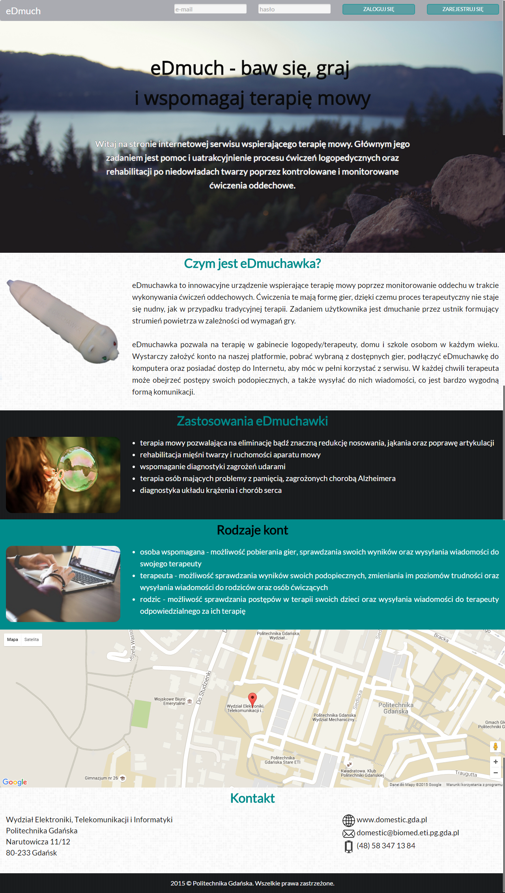
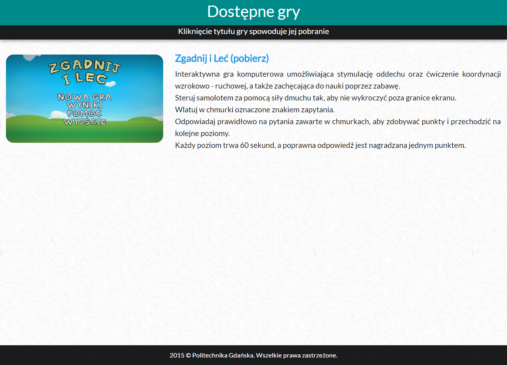
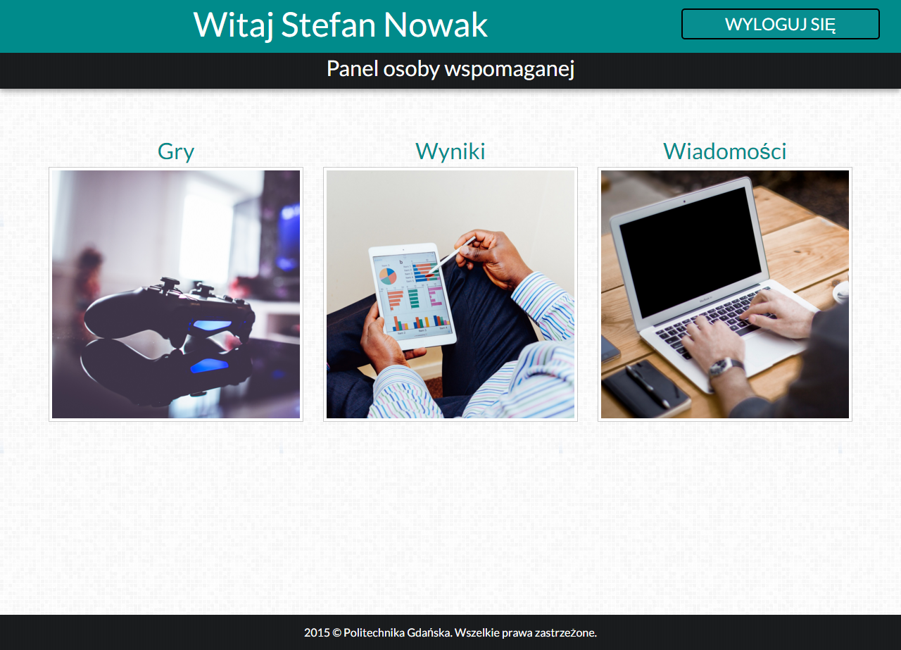
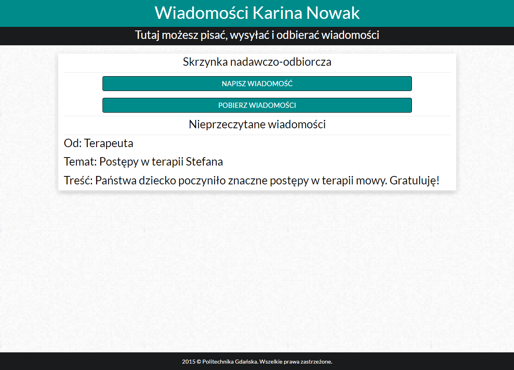
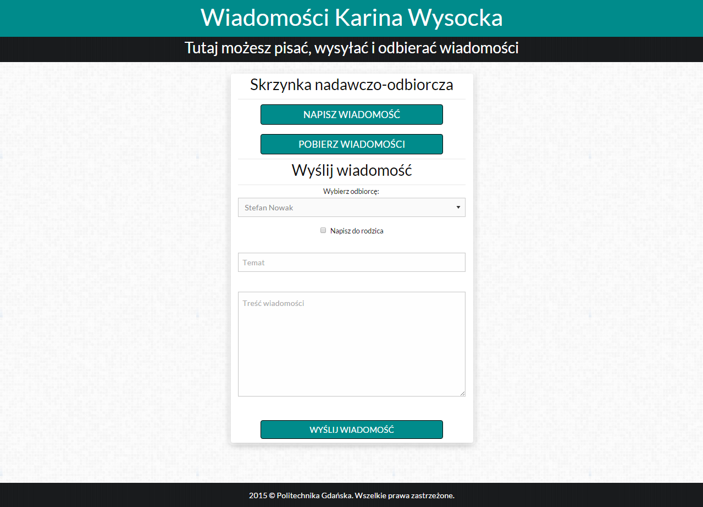
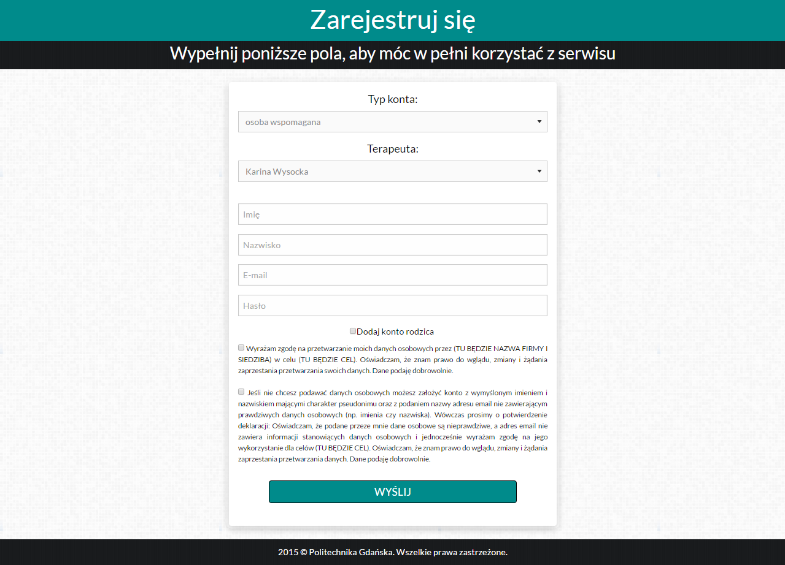
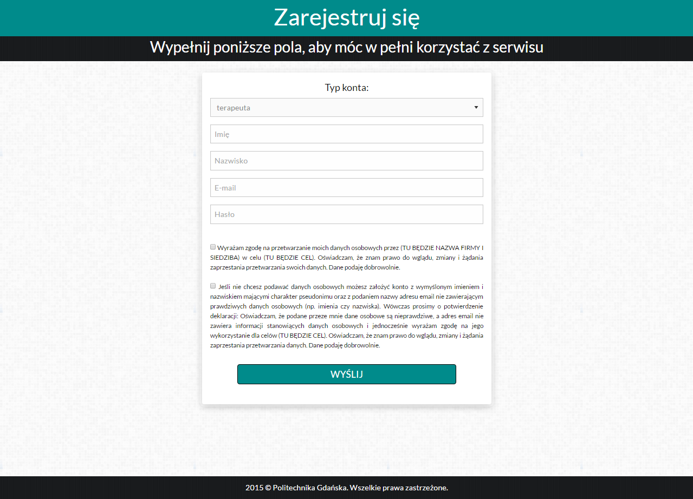
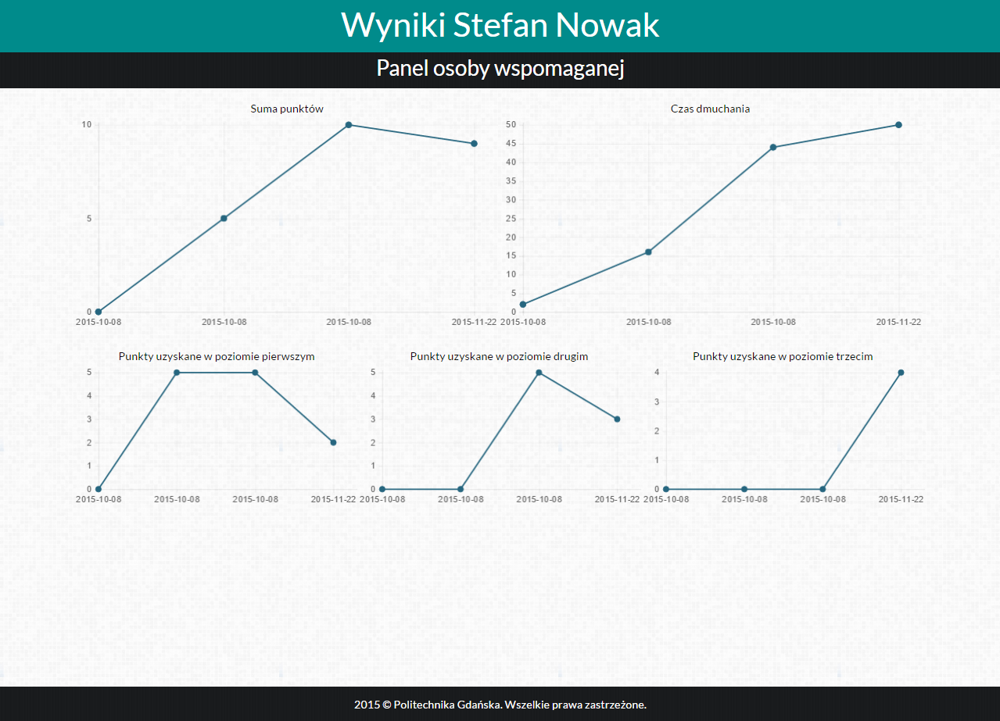
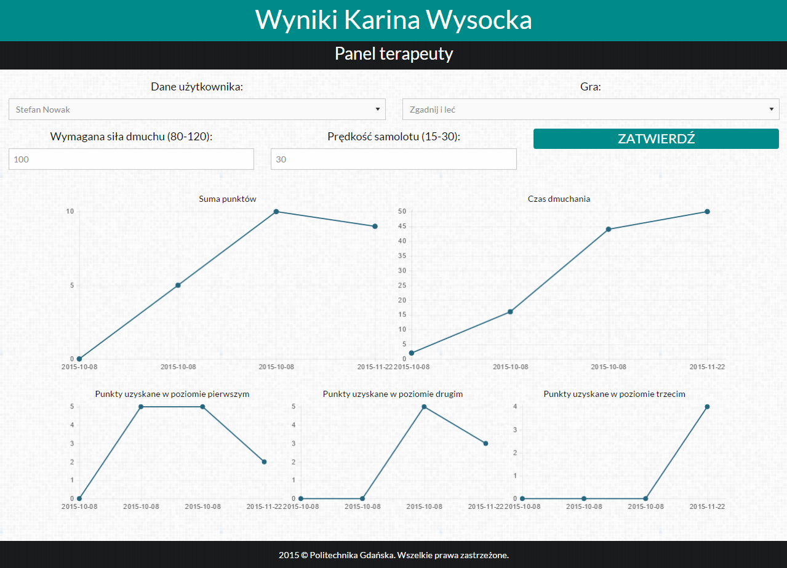

# speech-therapy (eDmuch)

![Language][language-url] ![License][license-url] ![Version][version-url] ![Done][done-url] ![Maintenance][maintenance-url]

### System for supporting speech therapy

#### The web-based system is associated with a game [Guess and fly](https://github.com/kawasilewska/guess-and-fly-cs). Upon completion of the game, the scores are saved in the database and displayed in the system as graphs. This enables therapists and parents to keep track of their pupils' progress.

##### This web-based system has the ability to establish three types of accounts: the assisted person, parent and therapist. This allows exercisers log in to the system, download therapeutic games designed to work with the controller, which is [eDmuchawka](http://www.domestic.gda.pl/?p=136&lang=en), perform therapy, and after its completion to track progress visualized in graphs. Moreover, a parent and therapist have an insight into the results of assisted person. The graphical interface of the website, games and music are clear, intuitive and child friendly, as can be seen in the screenshots below.

## Screenshots
  
  
  

## Used libraries/modules

* [ZURB Foundation 6](http://foundation.zurb.com/)
* [Maps JavaScript API](https://developers.google.com/maps/documentation/javascript/)
* [Chart.js](http://www.chartjs.org/)
* [Nicescroll 3](http://areaaperta.com/nicescroll/)
* [skrollr](https://github.com/Prinzhorn/skrollr)

## Content (in English)
| Filename                                                                                                | Content                                                                                                                                                                                                                                                                                                                                                                                                               |
| ------------------------------------------------------------------------------------------------------- | ----------------------------------------------------------------------------------------------------------------------------------------------------------------------------------------------------------------------------------------------------------------------------------------------------------------------------------------------------------------------------------------------------------------------- |
| [check.php](https://github.com/kawasilewska/speech-therapy/blob/master/check.php)                       | Checking that the email address listed in the assisted person/therapist registration form is occupied, used in [register.php](https://github.com/kawasilewska/speech-therapy/blob/master/register.php)                                                                                                                                                                                                        |
| [checkp.php](https://github.com/kawasilewska/speech-therapy/blob/master/checkp.php)                     | Checking that the email address listed in the parent registration form is occupied, used in [register.php](https://github.com/kawasilewska/speech-therapy/blob/master/register.php)                                                                                                                                                                                                                            |
| [connect.php](https://github.com/kawasilewska/speech-therapy/blob/master/connect.php)                   | Connecting to the database                                                                                                                                                                                                                                                                                                                                                                                   |
| [games.php](https://github.com/kawasilewska/speech-therapy/blob/master/games.php)                       | Displaying available games in assisted person account                                                                                                                                                                                                                                                                                                                                                                |
| [gamesr.php](https://github.com/kawasilewska/speech-therapy/blob/master/gamesr.php)                     | Displaying available games in parent account                                                                                                                                                                                                                                                                                                                                                                          |
| [gamest.php](https://github.com/kawasilewska/speech-therapy/blob/master/gamest.php)                     | Displaying available games in therapist account                                                                                                                                                                                                                                                                                                                                                                        |
| [getparam.php](https://github.com/kawasilewska/speech-therapy/blob/master/getparam.php)                 | Downloading labels from the database with parameters that change the difficulty of the therapeutic game, used in [scorest.php](https://github.com/kawasilewska/speech-therapy/blob/master/scorest.php)                                                                                                                                                                                                                       |
| [index.php](https://github.com/kawasilewska/speech-therapy/blob/master/index.php)                       | Homepage of the system                                                                                                                                                                                                                                                                                                                                                                                     |
| [logout.php](https://github.com/kawasilewska/speech-therapy/blob/master/logout.php)                     | Realization of logout from game                                                                                                                                                                                                                                                                                                                                                                                            |
| [messages.php](https://github.com/kawasilewska/speech-therapy/blob/master/messages.php)                 | Sending and receiving messages, the following scripts are used: [parent.php](https://github.com/kawasilewska/speech-therapy/blob/master/parent.php), [sendmsg.php](https://github.com/kawasilewska/speech-therapy/blob/master/sendmsg.php), [napisz.php](https://github.com/kawasilewska/speech-therapy/blob/master/napisz.php), [recmsg.php](https://github.com/kawasilewska/speech-therapy/blob/master/recmsg.php) |
| [myscores.php](https://github.com/kawasilewska/speech-therapy/blob/master/myscores.php)                 | Page responsible for displaying graphical results in assisted person account                                                                                                                                                                                                                                                                                                                           |
| [napisz.php](https://github.com/kawasilewska/speech-therapy/blob/master/napisz.php)                     | Loading a form to write a message by the therapist, used in [messages.php](https://github.com/kawasilewska/speech-therapy/blob/master/messages.php)                                                                                                                                                                                                                                          |
| [panelo.php](https://github.com/kawasilewska/speech-therapy/blob/master/panelo.php)                     | Displaying panel when the assisted person is logged in                                                                                                                                                                                                                                                                                                                                                         |
| [panelr.php](https://github.com/kawasilewska/speech-therapy/blob/master/panelr.php)                     | Displaying panel when the parent is logged in                                                                                                                                                                                                                                                                                                                                                                    |
| [panelt.php](https://github.com/kawasilewska/speech-therapy/blob/master/panelt.php)                     | Displaying panel when the therapist is logged in                                                                                                                                                                                                                                                                                                                                                                  |
| [parent.php](https://github.com/kawasilewska/speech-therapy/blob/master/parent.php)                     | Selecting the parent as the message receiver, used in [messages.php](https://github.com/kawasilewska/speech-therapy/blob/master/messages.php)                                                                                                                                                                                                                                                                            |
| [parentform.php](https://github.com/kawasilewska/speech-therapy/blob/master/parentform.php)             | Parent registration form along with the possibility of consent to the processing of personal data, used in [register.php](https://github.com/kawasilewska/speech-therapy/blob/master/register.php)                                                                                                                                                                                                                    |
| [recmsg.php](https://github.com/kawasilewska/speech-therapy/blob/master/recmsg.php)                     | Handling unread messages, used in [messages.php](https://github.com/kawasilewska/speech-therapy/blob/master/messages.php)                                                                                                                                                                                                                                                                                  |
| [register.php](https://github.com/kawasilewska/speech-therapy/blob/master/register.php)                 | User registration form with the statement expressing / not agreeing to the processing of personal data, checking whether the given e-mail address is occupied and setting initial parameters of the therapeutic game                                                                                                                                                                        |
| [scoresr.php](https://github.com/kawasilewska/speech-therapy/blob/master/scoresr.php)                   | Page responsible for displaying graphical results in the parent's account                                                                                                                                                                                                                                                                                                                                      |
| [scorest.php](https://github.com/kawasilewska/speech-therapy/blob/master/scorest.php)                   | Page responsible for displaying graphical results in the therapist's account                                                                                                                                                                                                                                                                                                                                    |
| [sendmsg.php](https://github.com/kawasilewska/speech-therapy/blob/master/sendmsg.php)                   | Sending messages, used in [messages.php](https://github.com/kawasilewska/speech-therapy/blob/master/messages.php)                                                                                                                                                                                                                                                                                                  |
| [settings.php](https://github.com/kawasilewska/speech-therapy/blob/master/settings.php)                 | Changing parameters that determine the difficulty level of the therapeutic game, used in [scorest.php](https://github.com/kawasilewska/speech-therapy/blob/master/scorest.php)                                                                                                                                                                                                                                                    |
| [therapistsform.php](https://github.com/kawasilewska/speech-therapy/blob/master/therapistsform.php)     | Displaying available therapists as a drop down list during registration                                                                                                                                                                                                                                                                                                                                     |
| [wykres.php](https://github.com/kawasilewska/speech-therapy/blob/master/wykres.php)                     | Generating graphs, used in [myscores.php](https://github.com/kawasilewska/speech-therapy/blob/master/myscores.php), [scoresr.php](https://github.com/kawasilewska/speech-therapy/blob/master/scoresr.php), [scorest.php](https://github.com/kawasilewska/speech-therapy/blob/master/scorest.php)                                                                                                                   |
| [zaloguj.php](https://github.com/kawasilewska/speech-therapy/blob/master/zaloguj.php)                   | Realization of logging into the system                                                                                                                                                                                                                                                                                                                                                                                       |
| [unity/addresult.php](https://github.com/kawasilewska/speech-therapy/blob/master/unity/addresult.php)   | Inserting the results obtained in a therapeutic game into the database                                                                                                                                                                                                                                                                                                                                                      |
| [unity/connect.php](https://github.com/kawasilewska/speech-therapy/blob/master/unity/connect.php)       | Connecting to the database                                                                                                                                                                                                                                                                                                                                                                                   |
| [unity/login.php](https://github.com/kawasilewska/speech-therapy/blob/master/unity/login.php)           | Logging into a game with database-based authentication                                                                                                                                                                                                                                                                                                                                                           |
| [unity/parameters.php](https://github.com/kawasilewska/speech-therapy/blob/master/unity/parameters.php) | Downloading parameters that determine the difficulty of the game, saving them in JSON format, and sending them to the therapeutic games                                                                                                                                                                                                                                                                                              |
| [unity/scores.php](https://github.com/kawasilewska/speech-therapy/blob/master/unity/scores.php)         | Downloading the results of the last game played, saving them in JSON format, and sending them to the therapeutic games                                                                                                                                                                                                                                                                                                            |

## Content (in Polish)
| Nazwa pliku                                                                                             | Zawartość                                                                                                                                                                                                                                                                                                                                                                                                               |
| ------------------------------------------------------------------------------------------------------- | ----------------------------------------------------------------------------------------------------------------------------------------------------------------------------------------------------------------------------------------------------------------------------------------------------------------------------------------------------------------------------------------------------------------------- |
| [check.php](https://github.com/kawasilewska/speech-therapy/blob/master/check.php)                       | Sprawdzenie, czy podany adres mailowy podany w formularzu rejestracji osoby wspomaganej/terapeuty jest zajęty, używany w [register.php](https://github.com/kawasilewska/speech-therapy/blob/master/register.php)                                                                                                                                                                                                        |
| [checkp.php](https://github.com/kawasilewska/speech-therapy/blob/master/checkp.php)                     | Sprawdzenie, czy podany adres mailowy podany w formularzu rejestracji rodzica jest zajęty, używany w [register.php](https://github.com/kawasilewska/speech-therapy/blob/master/register.php)                                                                                                                                                                                                                            |
| [connect.php](https://github.com/kawasilewska/speech-therapy/blob/master/connect.php)                   | Nawiązywanie połączenia z bazą danych                                                                                                                                                                                                                                                                                                                                                                                   |
| [games.php](https://github.com/kawasilewska/speech-therapy/blob/master/games.php)                       | Wyświetlenie dostępnych gier na koncie osoby wspomaganej                                                                                                                                                                                                                                                                                                                                                                |
| [gamesr.php](https://github.com/kawasilewska/speech-therapy/blob/master/gamesr.php)                     | Wyświetlenie dostępnych gier na koncie rodzica                                                                                                                                                                                                                                                                                                                                                                          |
| [gamest.php](https://github.com/kawasilewska/speech-therapy/blob/master/gamest.php)                     | Wyświetlenie dostępnych gier na koncie terapeuty                                                                                                                                                                                                                                                                                                                                                                        |
| [getparam.php](https://github.com/kawasilewska/speech-therapy/blob/master/getparam.php)                 | Pobieranie z bazy danych etykiet z parametrami warunkującymi zmianę trudności gry terapeutycznej, używany w [scorest.php](https://github.com/kawasilewska/speech-therapy/blob/master/scorest.php)                                                                                                                                                                                                                       |
| [index.php](https://github.com/kawasilewska/speech-therapy/blob/master/index.php)                       | Strona główna systemu internetowego                                                                                                                                                                                                                                                                                                                                                                                     |
| [logout.php](https://github.com/kawasilewska/speech-therapy/blob/master/logout.php)                     | Realizacja wylogowania z gry                                                                                                                                                                                                                                                                                                                                                                                            |
| [messages.php](https://github.com/kawasilewska/speech-therapy/blob/master/messages.php)                 | Wysyłanie i odbieranie wiadomości, używane są następujące skrypty: [parent.php](https://github.com/kawasilewska/speech-therapy/blob/master/parent.php), [sendmsg.php](https://github.com/kawasilewska/speech-therapy/blob/master/sendmsg.php), [napisz.php](https://github.com/kawasilewska/speech-therapy/blob/master/napisz.php), [recmsg.php](https://github.com/kawasilewska/speech-therapy/blob/master/recmsg.php) |
| [myscores.php](https://github.com/kawasilewska/speech-therapy/blob/master/myscores.php)                 | Strona odpowiedzialna za wyświetlanie wyników w postaci wykresów na koncie osoby wspomaganej                                                                                                                                                                                                                                                                                                                            |
| [napisz.php](https://github.com/kawasilewska/speech-therapy/blob/master/napisz.php)                     | Załadowanie formularza umożliwiającego napisanie wiadomości przez terapeutę, używany w [messages.php](https://github.com/kawasilewska/speech-therapy/blob/master/messages.php)                                                                                                                                                                                                                                          |
| [panelo.php](https://github.com/kawasilewska/speech-therapy/blob/master/panelo.php)                     | Wyświetlenie panelu widocznego po zalogowaniu osoby wspomaganej                                                                                                                                                                                                                                                                                                                                                         |
| [panelr.php](https://github.com/kawasilewska/speech-therapy/blob/master/panelr.php)                     | Wyświetlenie panelu widocznego po zalogowaniu rodzica                                                                                                                                                                                                                                                                                                                                                                   |
| [panelt.php](https://github.com/kawasilewska/speech-therapy/blob/master/panelt.php)                     | Wyświetlenie panelu widocznego po zalogowaniu terapeuty                                                                                                                                                                                                                                                                                                                                                                 |
| [parent.php](https://github.com/kawasilewska/speech-therapy/blob/master/parent.php)                     | Wybranie rodzica jako odbiorcę wiadomości, używany w [messages.php](https://github.com/kawasilewska/speech-therapy/blob/master/messages.php)                                                                                                                                                                                                                                                                            |
| [parentform.php](https://github.com/kawasilewska/speech-therapy/blob/master/parentform.php)             | Formularz rejestracji rodzica wraz z możliwością wyrażenia zgody na przetwarzanie danych osobowych, używany w [register.php](https://github.com/kawasilewska/speech-therapy/blob/master/register.php)                                                                                                                                                                                                                    |
| [recmsg.php](https://github.com/kawasilewska/speech-therapy/blob/master/recmsg.php)                     | Obsługa nieprzeczytanych wiadomości, używany w [messages.php](https://github.com/kawasilewska/speech-therapy/blob/master/messages.php)                                                                                                                                                                                                                                                                                  |
| [register.php](https://github.com/kawasilewska/speech-therapy/blob/master/register.php)                 | Formularz rejestracji użytkowników wraz z pobraniem deklaracji wyrażającej/nie wyrażającej zgody na przetwarzanie danych osobowych, sprawdzeniem, czy dany adres mailowy jest zajęty oraz ustawieniem parametrów początkowych gry terapeutycznej                                                                                                                                                                        |
| [scoresr.php](https://github.com/kawasilewska/speech-therapy/blob/master/scoresr.php)                   | Strona odpowiedzialna za wyświetlanie wyników w postaci wykresów na koncie rodzica                                                                                                                                                                                                                                                                                                                                      |
| [scorest.php](https://github.com/kawasilewska/speech-therapy/blob/master/scorest.php)                   | Strona odpowiedzialna za wyświetlanie wyników w postaci wykresów na koncie terapeuty                                                                                                                                                                                                                                                                                                                                    |
| [sendmsg.php](https://github.com/kawasilewska/speech-therapy/blob/master/sendmsg.php)                   | Wysłanie wiadomości, używany w [messages.php](https://github.com/kawasilewska/speech-therapy/blob/master/messages.php)                                                                                                                                                                                                                                                                                                  |
| [settings.php](https://github.com/kawasilewska/speech-therapy/blob/master/settings.php)                 | Zmiana parametrów warunkujących poziom trudności gry terapeutycznej, używany w [scorest.php](https://github.com/kawasilewska/speech-therapy/blob/master/scorest.php)                                                                                                                                                                                                                                                    |
| [therapistsform.php](https://github.com/kawasilewska/speech-therapy/blob/master/therapistsform.php)     | Wyświetlenie dostępnych terapeutów w postaci rozwijanej listy w trakcie rejestracji                                                                                                                                                                                                                                                                                                                                     |
| [wykres.php](https://github.com/kawasilewska/speech-therapy/blob/master/wykres.php)                     | Generowanie wykresów, używany w [myscores.php](https://github.com/kawasilewska/speech-therapy/blob/master/myscores.php), [scoresr.php](https://github.com/kawasilewska/speech-therapy/blob/master/scoresr.php), [scorest.php](https://github.com/kawasilewska/speech-therapy/blob/master/scorest.php)                                                                                                                   |
| [zaloguj.php](https://github.com/kawasilewska/speech-therapy/blob/master/zaloguj.php)                   | Realizacja zalogowania do systemu                                                                                                                                                                                                                                                                                                                                                                                       |
| [unity/addresult.php](https://github.com/kawasilewska/speech-therapy/blob/master/unity/addresult.php)   | Wpisywanie do bazy danych uzyskanych wyników w grze terapeutycznej                                                                                                                                                                                                                                                                                                                                                      |
| [unity/connect.php](https://github.com/kawasilewska/speech-therapy/blob/master/unity/connect.php)       | Nawiązywanie połączenia z bazą danych                                                                                                                                                                                                                                                                                                                                                                                   |
| [unity/login.php](https://github.com/kawasilewska/speech-therapy/blob/master/unity/login.php)           | Logowanie do gry z uwierzytelnianiem na podstawie bazy danych                                                                                                                                                                                                                                                                                                                                                           |
| [unity/parameters.php](https://github.com/kawasilewska/speech-therapy/blob/master/unity/parameters.php) | Pobranie parametrów warunkujących poziom trudności gry, zapisanie ich w formacie JSON oraz przesłanie do gry terapeutycznej                                                                                                                                                                                                                                                                                              |
| [unity/scores.php](https://github.com/kawasilewska/speech-therapy/blob/master/unity/scores.php)         | Pobranie wyników ostatnio rozegranej gry, zapsanie ich w formacie JSON oraz przesłanie do gry terapeutycznej                                                                                                                                                                                                                                                                                                            |

[language-url]: https://img.shields.io/badge/language-PHP-lightgrey.svg?style=flat "Language"
[license-url]: https://img.shields.io/badge/license-Apache%202-blue.svg?style=flat "License"
[version-url]: https://img.shields.io/badge/version-1.0.0-brightgreen.svg?style=flat "Version"
[done-url]: https://img.shields.io/badge/done-01.2016-yellow.svg?style=flat "Done"
[maintenance-url]: https://img.shields.io/maintenance/no/2014.svg?style=flat "Maintenance"
